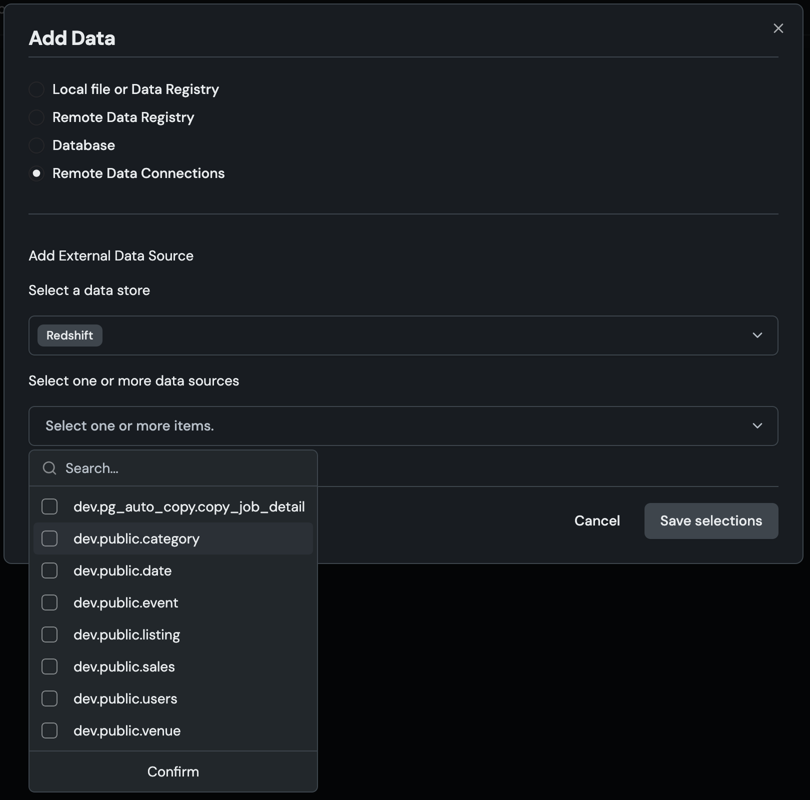

# Talk to My Data

**Talk to My Data** delivers a seamless **talk-to-your-data** experience, transforming files, spreadsheets, and cloud data into actionable insights. Simply upload data, connect to Snowflake or BigQuery, or access datasets from DataRobot's Data Registry. Then, ask a question, and the agent recommends business analyses, generating **charts, tables, and even code** to help you interpret the results.

This intuitive experience is designed for **scalability and flexibility**, ensuring that whether you're working with a few thousand rows or billions, your data analysis remains **fast, efficient, and insightful**.

> [!WARNING]
> Application templates are intended to be starting points that provide guidance on how to develop, serve, and maintain AI applications.
> They require a developer or data scientist to adapt and modify them for their business requirements before being put into production.


## Table of contents

1. [Quick Start](#-quick-start)
2. [Prerequisites](#prerequisites)
3. [User's Guide](#users-guide)
4. [Architecture overview](#architecture-overview)
5. [Why build AI Apps with DataRobot app templates?](#why-build-ai-apps-with-datarobot-app-templates)
6. [Data privacy](#data-privacy)
7. [Make changes](#make-changes)
   - [Change the LLM](#change-the-llm)
   - [Change the database](#change-the-database)
     - [Snowflake](#snowflake)
     - [BigQuery](#bigquery)
   - [Change the frontend](#change-the-frontend)
8. [Tools](#tools)
9. [Share results](#share-results)
10. [Delete all provisioned resources](#delete-all-provisioned-resources)
11. [Note](#note)

## 🚀 Quick Start

### Quickstart with DataRobot CLI

#### 1. Install the DataRobot CLI

If you haven't already, install the DataRobot CLI by following the installation instructions at:
https://github.com/datarobot-oss/cli?tab=readme-ov-file#installation

#### 2. Start the Application

Run the following command to start the Talk To My Data application. An interactive wizard will guide you through the selection of configuration options, including creating a `.env` file in the root directory and populating it with environment variables you specify during the wizard.

```sh
dr start
```

The DataRobot CLI (`dr`) will:
- Guide you through configuration setup
- Create and populate your `.env` file with the necessary environment variables
- Deploy your application to DataRobot
- Display a link to your running application when complete

When deployment completes, the terminal will display a link to your running application.\
👉 **Click the link to open and start using your app!**

Additionally, please find a guided Talk To My Data walkthrough [here](https://docs.datarobot.com/en/docs/get-started/gs-dr5/talk-data-walk.html).

### Build in Codespace

If you're using **DataRobot Codespace**, everything you need is already installed.
Follow the steps below to launch the entire application in just a few minutes.

Use the built-in terminal on the left sidebar of the Codespace.

From the project root:

```sh
dr start
```

When deployment completes, the terminal will display a link to your running application.\
👉 **Click the link to open and start using your app!**

Additionally, please find a guided Talk To My Data walkthrough [here](https://docs.datarobot.com/en/docs/get-started/gs-dr5/talk-data-walk.html).

### Template Development

For local development, follow all of the steps below.

#### 0. Windows-specific Preparation

If using a Mac or Linux laptop or a codespace, skip this step. Windows needs additional configuration
to support the symlinks used in this project. The below steps leverage the [winget package manager](https://learn.microsoft.com/en-us/windows/package-manager/winget/)
to install dependencies and enable symlinks.

```powershell
# Python
winget install --id=Python.Python.3.12 -e
# Taskfile.dev
winget install --id=Task.Task -e
# uv
winget install --id=astral-sh.uv  -e
# Node.js
winget install --id=OpenJS.NodeJS -e
# Pulumi
winget install pulumi
winget upgrade pulumi
# Windows Developer Tools
winget install Microsoft.VisualStudio.2022.BuildTools --force --override "--wait --passive --add Microsoft.VisualStudio.Component.VC.Tools.x86.x64 --add Microsoft.VisualStudio.Component.Windows11SDK.22621"
# Visual Code Redistributable (required by DuckDB)
winget install -e --id Microsoft.VCRedist.2015+.x86

# For Windows 10/11, toggle Developer Mode to "On" under System > For developer to enable symbolic link
# Additionally, we use symlinks in the repo. Please set
git config --global core.symlink true
# Alternatively, you can do it for just this repo by omitting the --global and running this in the repo.
```

#### 1. Install Pulumi (if you don’t have it yet)

If Pulumi is not already installed, follow the installation instructions in the Pulumi [documentation](https://www.pulumi.com/docs/iac/download-install/).
After installing for the first time, **restart your terminal** and run:

```sh
pulumi login --local      # omit --local to use Pulumi Cloud (requires an account)
```

#### 2. Clone the Template Repository

```sh
git clone https://github.com/datarobot-community/talk-to-my-data-agent.git
cd talk-to-my-data-agent
```

#### 3. Create and Populate Your `.env` File
This command generates a `.env` file from `.env.template` to walk you through the required credentials setup automatically.
```sh
dr dotenv setup
```
If you want to locate the credentials manually:

- DataRobot API Token:
  See Create a DataRobot API Key in the [DataRobot API Quickstart docs](https://docs.datarobot.com/en/docs/api/api-quickstart/index.html#create-a-datarobot-api-key).

- DataRobot Endpoint:
  See Retrieve the API Endpoint in the same [Quickstart docs](https://docs.datarobot.com/en/docs/api/api-quickstart/index.html#retrieve-the-api-endpoint).

- LLM Endpoint & API Key (Azure OpenAI):
  Refer to the [Azure OpenAI documentation](https://learn.microsoft.com/en-us/azure/ai-services/openai/chatgpt-quickstart?tabs=command-line%2Cjavascript-keyless%2Ctypescript-keyless%2Cpython-new&pivots=programming-language-python#retrieve-key-and-endpoint) for your resource and deployment values.

#### 4. Develop the Template

See the [React Frontend Development Guide](app_frontend/README.md) and [FastAPI Backend Development Guide](app_backend/README.md).

Run the following to deploy or update your application:
```bash
task deploy
```

## Prerequisites

If you are using DataRobot Codespaces, this is already complete for you. If not, install:

- [Python](https://www.python.org/downloads/) 3.10+
- [uv](https://docs.astral.sh/uv/getting-started/installation/) (Python package manager)
- [Taskfile.dev](https://taskfile.dev/#/installation) (task runner)
- [Node.js](https://nodejs.org/en/download/) 18+ (for React frontend)
- [Pulumi](https://www.pulumi.com/docs/iac/download-install/) (infrastructure as code)


## User's Guide

The basic usage of the app is straightforward. The user uploads one or more structured files to the application, starts a chat and asks questions about those files.
Behind the scenes, the LLM configured for the application translates the user's question into code, the application runs the code and again sends the results to
an LLM to generate analysis and visualizations. Because the dataset is loaded into the application itself, this limits the size of the data that can be analyzed.
The application can support larger datasets and connect to remote data stores through the DataRobot platform, described below.

### Connecting to Data Stores in the DataRobot Platform

When a user of the application is a DataRobot user (see [this documentation](https://docs.datarobot.com/en/docs/workbench/wb-apps/custom-apps/nxt-manage-custom-app.html#share-applications)
for sharing applications) and has data stores configured in the DataRobot platform (see [this page for configuring data stores](https://docs.datarobot.com/en/docs/platform/acct-settings/nxt-data-connect.html)
and [this page for details on supported data stores](https://docs.datarobot.com/en/docs/reference/data-ref/data-sources/index.html))
of a supported connection (currently Postgres and Redshift), these will appear in the application as a "Remote Data Connection" (see screenshot below).
These DataStores will be queried via DataRobot's data wrangling platform ([see documentation](https://docs.datarobot.com/en/docs/workbench/wb-dataprep/wb-wrangle-data/wb-sql-editor.html)).
Unlike the app's bespoke database integration (see [Change the database](#change-the-database)), a data store will not be visible to all users of the app, only to those who have access to
the data store and its default credentials in the DataRobot platform.



## Architecture overview


App templates contain three families of complementary logic:

- **App Logic**: Necessary for user consumption; whether via a hosted front-end or integrating into an external consumption layer.
  ```
  app_frontend/  # React frontend (recommended, default) with the api located in app_backend
  frontend/  # Streamlit frontend (deprecated, will be removed March 20th, 2026)
  core/  # App business logic & runtime helpers
  ```
- **Operational Logic**: Necessary to activate DataRobot assets.
  ```
  infra/__main__.py  # Pulumi program for configuring DataRobot to serve and monitor AI and app logic
  infra/  # Settings for resources and assets created in DataRobot
  ```

## Why build AI Apps with DataRobot app templates?

App Templates transform your AI projects from notebooks to production-ready applications. Too often, getting models into production means rewriting code, juggling credentials, and coordinating with multiple tools and teams just to make simple changes. DataRobot's composable AI apps framework eliminates these bottlenecks, letting you spend more time experimenting with your ML and app logic and less time wrestling with plumbing and deployment.

- Start building in minutes: Deploy complete AI applications instantly, then customize the AI logic or the front-end independently (no architectural rewrites needed).
- Keep working your way: Data scientists keep working in notebooks, developers in IDEs, and configs stay isolated. Update any piece without breaking others.
- Iterate with confidence: Make changes locally and deploy with confidence. Spend less time writing and troubleshooting plumbing and more time improving your app.

Each template provides an end-to-end AI architecture, from raw inputs to deployed application, while remaining highly customizable for specific business requirements.

## Data privacy

Your data privacy is important to us. Data handling is governed by the DataRobot [Privacy Policy](https://www.datarobot.com/privacy/), please review before using your own data with DataRobot.

## Make changes

### Change the LLM

Talk to My Data supports multiple flexible LLM options including:

- LLM Gateway direct (default)
- LLM Blueprint with LLM Gateway
- Already Deployed Text Generation model in DataRobot
- Registered model such as an NVIDIA NIM
- LLM Blueprint with an External LLM

#### LiteLLM usage

This project uses LiteLLM as a unified interface for LLMs. LiteLLM supports DataRobot natively and verifies that your setup works correctly. When a model name is prefixed with `datarobot/`, LiteLLM checks the DataRobot-supported model. If you use an external provider, the prefix reflects that instead (e.g., `azure/gpt-5-1`).

#### LLM configuration recommended option

You can edit the LLM configuration by manually changing which configuration is active. Simply run:

```bash
ln -sf ../configurations/<chosen_configuration> infra/infra/llm.py
```

After doing so, you'll likely want to edit the `llm.py` to have the correct model selected. Particularly for non-LLM Gateway options.

#### LLM configuration options

You can configure the LLM dynamically by setting the following environment variable:

```
INFRA_ENABLE_LLM=<chosen_configuration>
```

Choose one of the available configurations from the `infra/configurations/llm` directory.

By default, the system uses the LLM Gateway in direct mode, equivalent to:

```
INFRA_ENABLE_LLM=gateway_direct.py
```

Below are examples of each configuration using this dynamic setup:

##### LLM Blueprint with LLM Gateway

To switch to the LLM Blueprint with LLM Gateway, set the following:

```bash
INFRA_ENABLE_LLM=blueprint_with_llm_gateway.py
```

##### Existing LLM deployment in DataRobot

Uncomment and configure these in your `.env` file:

```bash
TEXTGEN_DEPLOYMENT_ID=<your_deployment_id>
INFRA_ENABLE_LLM=deployed_llm.py
LLM_DEFAULT_MODEL=<your llm_default_model>
```

For more details, see [Configure LLM_DEFAULT_MODEL](#configure-llm_default_model)

##### Registered model with LLM Blueprint

Like an NVIDIA NIM. This also shows how you can adjust the timeout in case getting a GPU takes a long time:

```bash
DATAROBOT_TIMEOUT_MINUTES=120
TEXTGEN_REGISTERED_MODEL_ID='<Your Registered Model ID>'
INFRA_ENABLE_LLM=registered_model.py
```

##### External LLM provider

Configure an LLM with an external LLM provider like Azure, Bedrock, Anthropic, or VertexAI. Here's an Azure AI example:

```bash
INFRA_ENABLE_LLM=blueprint_with_external_llm.py
OPENAI_API_VERSION='2024-08-01-preview'
OPENAI_API_BASE='https://<your_custom_endpoint>.openai.azure.com'
OPENAI_API_DEPLOYMENT_ID='<your deployment_id>'
OPENAI_API_KEY='<your_api_key>'
```

See the [DataRobot documentation](https://docs.datarobot.com/en/docs/gen-ai/playground-tools/deploy-llm.html) for details on other providers.

In addition to the changes for the `.env` file, you can also edit the respective `llm.py` file to make additional changes such as the default LLM, temperature, top_p, etc within the chosen configuration

#### Configure LLM_DEFAULT_MODEL

If you want to use a different default model for configuration testing, you can update it by setting `LLM_DEFAULT_MODEL` before deploying. Supported external prefixes: `azure`, `bedrock`, `vertex_ai`, `anthropic`.

```bash
LLM_DEFAULT_MODEL="datarobot/azure/gpt-5-1-2025-11-13"  # Example for Azure OpenAI via DataRobot LLM Gateway 
```
If you want to use your own LLM credentials, omit the `datarobot/` prefix.

The full list of supported model names is available in the LLM Gateway catalog: https://app.datarobot.com/api/v2/genai/llmgw/catalog/

### Change the database

#### Snowflake

To add Snowflake support:

1. Add `DATABASE_CONNECTION_TYPE = "snowflake"` to the `.env`.
2. Provide snowflake credentials in `.env` by either setting `SNOWFLAKE_USER` and `SNOWFLAKE_PASSWORD` or by setting `SNOWFLAKE_KEY_PATH` to a file containing the key. The key file should be a `*.p8` private key file. (see [Snowflake Documentation](https://docs.snowflake.com/en/user-guide/key-pair-auth))
3. Fill out the remaining snowflake connection settings in `.env` (refer to `.env.template` for more details)
4. Run `task deploy`.

#### BigQuery

The Talk to my Data Agent supports connecting to BigQuery.

1. Add `DATABASE_CONNECTION_TYPE = "bigquery"` to the `.env`.
2. Provide the required google credentials in `.env` dependent on your choice. Ensure that GOOGLE_DB_SCHEMA is also populated in `.env`.
3. Run `task deploy`.

#### SAP Datasphere

The Talk to my Data Agent supports connecting to SAP Datasphere.

1. Add `DATABASE_CONNECTION_TYPE = "sap"` to the `.env`.
2. Provide the required SAP credentials in `.env`.
3. Run `task deploy`.

### Change the Frontend

> [!WARNING]
> **The Streamlit frontend is deprecated and will be removed March 20th, 2026.** We strongly recommend using the React frontend.

The Talk to My Data agent supports two frontend options:

- **React** (default, recommended): A modern JavaScript-based frontend with enhanced UI features which uses [FastAPI Backend](app_backend/README.md). See the [React Frontend Development Guide](app_frontend/README.md)
- **Streamlit** (deprecated): A Python-based frontend with a simple interface. **Will be removed March 20th, 2026.** See the [Streamlit Frontend Development Guide](frontend/README.md)

#### Using the Streamlit Frontend (Not Recommended)

If you need to temporarily use the deprecated Streamlit frontend:

1. In `.env`: Set `FRONTEND_TYPE="streamlit"` to use the Streamlit frontend instead of the default React.
2. Run `task deploy` to update your stack.

## Tools

You can help the data analyst python agent by providing tools that can assist with data analysis tasks. For that, define functions in `core/src/core/tools.py`. The function will be made available inside the code execution environment of the agent. The name, docstring and signature will be provided to the agent inside the prompt.

## Share results

1. Log into the DataRobot application.
2. Navigate to **Registry > Applications**.
3. Navigate to the application you want to share, open the actions menu, and select **Share** from the dropdown.

## Delete all provisioned resources

```bash
task infra:destroy
```

## Note

For projects that will be maintained, DataRobot recommends forking the repo so upstream fixes and improvements can be merged in the future.
