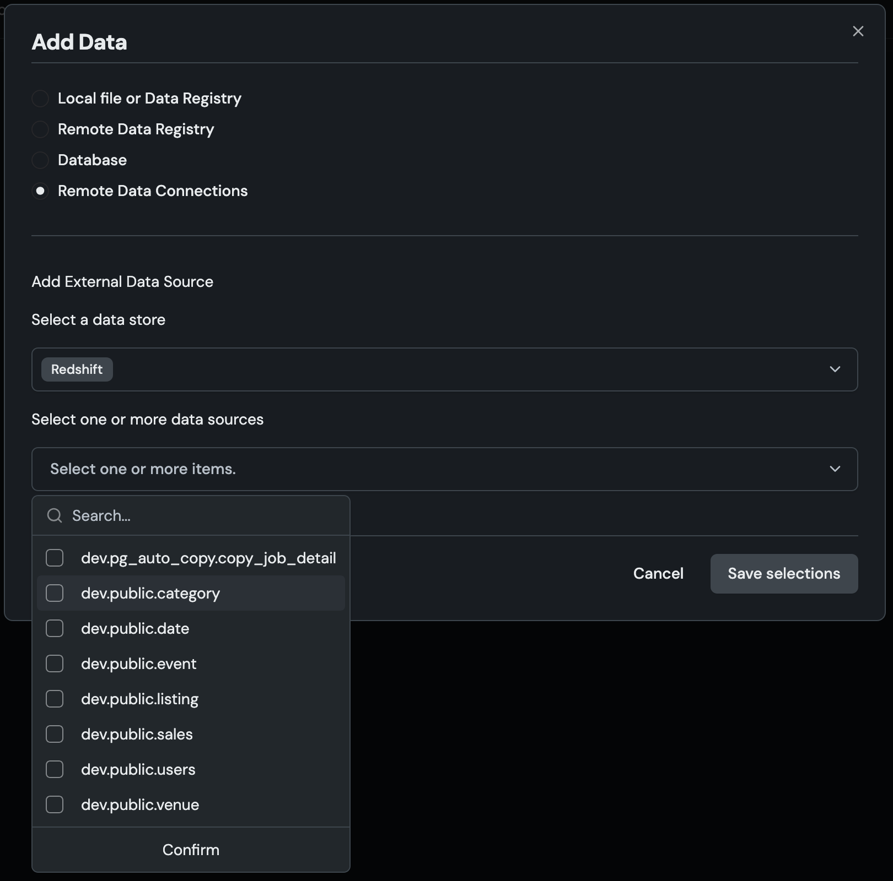

<p align="center">
  <a href="https://github.com/datarobot-community">
    
  </a>
</p>
<p align="center">
  <a href="https://app.datarobot.com/usecases/application-templates/67a0f7338be36c535d4dcaa0?referrerUrl=github">
    
  </a>
  <a href="https://app.eu.datarobot.com/usecases/application-templates/67a0f7338be36c535d4dcaa0?referrerUrl=github">
    
  </a>
  <a href="https://app.jp.datarobot.com/usecases/application-templates/67a0f7338be36c535d4dcaa0?referrerUrl=github">
    
  </a>
  <a href="https://app.jp.datarobot.com/usecases/application-templates/67a0f7338be36c535d4dcaa0?referrerUrl=github">
    
  </a>
  <a href="https://join.slack.com/t/datarobot-community/shared_invite/zt-3uzfp8k50-SUdMqeux25ok9_5wr4okrg">
    
  </a>
</p>

# Talk to My Data

Talk to My Data delivers a seamless talk-to-your-data experience, transforming files, spreadsheets, and cloud data into actionable insights. Upload data, connect to Snowflake or BigQuery, or access datasets from the DataRobot Data Registry. Then ask a question and the agent recommends business analyses, generating charts, tables, and even code to help you interpret the results.

The template scales with your data. Whether you're working with a few thousand rows or billions of them, your analysis stays fast, efficient, and insightful.

> [!WARNING]
> Application templates are intended to be starting points that provide guidance on how to develop, serve, and maintain AI applications. They require a developer or data scientist to adapt and modify them for their business requirements before being put into production.


## Table of contents

1. [Quick start](#-quick-start)
2. [Prerequisites](#prerequisites)
3. [Usage guide](#usage-guide)
4. [Architecture overview](#architecture-overview)
5. [Why build AI apps with DataRobot app templates?](#why-build-ai-apps-with-datarobot-app-templates)
6. [Data privacy](#data-privacy)
7. [Make changes](#make-changes)
   - [Change the LLM](#change-the-llm)
   - [Change the database](#change-the-database)
     - [Snowflake](#snowflake)
     - [BigQuery](#bigquery)
8. [Tools](#tools)
9. [Share results](#share-results)
10. [Delete all provisioned resources](#delete-all-provisioned-resources)
11. [Maintaining this template](#maintaining-this-template)

## 🚀 Quick start

### Quick start with DataRobot CLI

#### 1. Install the DataRobot CLI

> [!TIP]
> If you are using **DataRobot codespace**, everything you need is already installed (including the DataRobot CLI).
> Follow the steps below to launch the application using the built-in terminal on the left sidebar of the Codespace.

If you have not already installed the DataRobot CLI, follow the installation instructions on its [GitHub repository](https://github.com/datarobot-oss/cli?tab=readme-ov-file#installation).

#### 2. Start the application

Run the following command to start the CLI setup wizard, which will allow you to configure and deploy the Talk to My Data application. The interactive wizard guides you through configuration options, including creating a `.env` file in the root directory and populating it with environment variables you specify.

```sh
dr start
```

The DataRobot CLI (`dr`):

- Guides you through configuration setup.
- Creates and populates your `.env` file with the necessary environment variables.
- Deploys your application to DataRobot.
- Displays a link to your running application when complete.

> [!TIP]
> When deployment completes, the terminal displays a link to your running application. **Click the link** to open and start using your app.

### Template development

For local development, follow the steps in the sections below.

<details><summary><b>Click here for Windows-specific preparation steps</b></summary>
<br>

If using a Mac or Linux laptop or a codespace, skip this step. Windows needs additional configuration
to support the symlinks used in this project. The below steps leverage the [winget package manager](https://learn.microsoft.com/en-us/windows/package-manager/winget/)
to install dependencies and enable symlinks.

```powershell
# Python
winget install --id=Python.Python.3.12 -e
# Taskfile.dev
winget install --id=Task.Task -e
# uv
winget install --id=astral-sh.uv  -e
# Node.js
winget install --id=OpenJS.NodeJS -e
# Pulumi
winget install pulumi
winget upgrade pulumi
# Windows Developer Tools
winget install Microsoft.VisualStudio.2022.BuildTools --force --override "--wait --passive --add Microsoft.VisualStudio.Component.VC.Tools.x86.x64 --add Microsoft.VisualStudio.Component.Windows11SDK.22621"
# Visual Code Redistributable (required by DuckDB)
winget install -e --id Microsoft.VCRedist.2015+.x86

# For Windows 10/11, toggle Developer Mode to "On" under System > For developer to enable symbolic link.
# This repository uses symlinks. Set the following.
git config --global core.symlink true
# Alternatively, run the same command without --global in the repo root to scope it to this repository only.
```

</details>

#### 1. Install Pulumi

If Pulumi is not already installed, follow the installation instructions in the [Pulumi documentation](https://www.pulumi.com/docs/iac/download-install/).

> [!IMPORTANT]
> After installing Pulumi for the first time, **restart your terminal**, then run the following.

```sh
pulumi login --local      # Omit --local to use Pulumi Cloud (requires an account).
```

#### 2. Clone the template repository

```sh
git clone https://github.com/datarobot-community/talk-to-my-data-agent.git
cd talk-to-my-data-agent
```

#### 3. Create and populate your `.env` file

This command generates a `.env` file from `.env.template` and walks you through the required credentials setup automatically.

```sh
dr dotenv setup
```

If you want to locate the credentials manually:

- **DataRobot API key**&mdash;see [Create a DataRobot API key](https://docs.datarobot.com/en/docs/api/api-quickstart/index.html#create-a-datarobot-api-key) in the DataRobot API quickstart.

- **DataRobot endpoint**&mdash;see [Retrieve the API endpoint](https://docs.datarobot.com/en/docs/api/api-quickstart/index.html#retrieve-the-api-endpoint) in the same quickstart.

- **LLM endpoint and API key (Azure OpenAI)**&mdash;see the [Azure OpenAI documentation](https://learn.microsoft.com/en-us/azure/ai-services/openai/chatgpt-quickstart?tabs=command-line%2Cjavascript-keyless%2Ctypescript-keyless%2Cpython-new&pivots=programming-language-python#retrieve-key-and-endpoint) for your resource and deployment values.

#### 4. Develop the template

See the [React frontend development guide](app_frontend/README.md) and [FastAPI backend development guide](app_backend/README.md).

Run the following to deploy or update your application.

```bash
task deploy
```

## Prerequisites

If you are using DataRobot Codespaces, this is already complete for you. If not, install:

- [Python](https://www.python.org/downloads/) 3.10+
- [uv](https://docs.astral.sh/uv/getting-started/installation/) (Python package manager)
- [Taskfile.dev](https://taskfile.dev/#/installation) (task runner)
- [Node.js](https://nodejs.org/en/download/) 18+ (for React frontend)
- [Pulumi](https://www.pulumi.com/docs/iac/download-install/) (infrastructure as code)

## Usage guide

Basic usage is straightforward: you upload one or more structured files to the application, start a chat, and ask questions about those files.
Behind the scenes, the LLM configured for the application translates your question into code, the application runs the code, and sends the results to
an LLM to generate analysis and visualizations. Because the dataset loads into the application itself, this limits the size of the data you can analyze.
The application supports larger datasets and remote data stores through the DataRobot platform, as described below.

### Connecting to data stores in the DataRobot platform

DataRobot can query data stores through the data wrangling platform (see [SQL Editor documentation](https://docs.datarobot.com/en/docs/workbench/wb-dataprep/wb-wrangle-data/wb-sql-editor.html)). In order to do so, you must set up the following:

1. Use the application as a DataRobot user (see [Share applications](https://docs.datarobot.com/en/docs/workbench/wb-apps/custom-apps/nxt-manage-custom-app.html#share-applications)).
2. Have data stores configured in the DataRobot platform (see [Configure data stores](https://docs.datarobot.com/en/docs/platform/acct-settings/nxt-data-connect.html) and [Supported data stores](https://docs.datarobot.com/en/docs/reference/data-ref/data-sources/index.html)).
3. Have a supported connection.

Once these conditions are met, the data stores appear in the application as a "Remote Data Connection" (see screenshot below).

> [!NOTE]
> Unlike the app database integration (see [Change the database](#change-the-database)), a data store is not visible to all users of the app. Only users who have access to the data store and its default credentials in the DataRobot platform can see it.

#### Supported remote data connections

If you have any of the following data stores configured in the DataRobot platform, you can connect to them from your application to query data.

- PostgreSQL
- Redshift
- Databricks
- MySQL



## Architecture overview


App templates contain three families of complementary logic.

- **App logic**&mdash;necessary for user consumption, whether through a hosted front end or integration into an external consumption layer.

  ```
  app_frontend/  # React frontend.
  app_backend/  # FastAPI web layer, app assembly, and route registration.
  core/  # Shared app business logic and runtime helpers.
  ```

- **Operational logic**&mdash;necessary to activate DataRobot assets.
  
  ```
  infra/__main__.py  # Pulumi program for configuring DataRobot to serve and monitor AI and app logic.
  infra/  # Settings for resources and assets created in DataRobot.
  ```

## Why build AI apps with DataRobot app templates?

App templates transform your AI projects from notebooks to production-ready applications. Too often, getting models into production means rewriting code, juggling credentials, and coordinating with multiple tools and teams to make simple changes. The composable AI apps framework from DataRobot removes these bottlenecks so you spend more time experimenting with ML and app logic and less time on plumbing and deployment.

- **Start building in minutes**&mdash;deploy complete AI applications instantly, then customize the AI logic or the front end independently, with no architectural rewrites required.
- **Keep working your way**&mdash;data scientists keep working in notebooks, developers in IDEs, and configs stay isolated. Update any piece without breaking others.
- **Iterate with confidence**&mdash;make changes locally and deploy with confidence. Spend less time writing and troubleshooting plumbing and more time improving your app.

Each template provides an end-to-end AI architecture, from raw inputs to deployed application, while remaining highly customizable for specific business requirements.

## Data privacy

Data handling follows the DataRobot [Privacy Policy](https://www.datarobot.com/privacy/). Review it before using your own data with DataRobot.

## Make changes

### Change the LLM

Talk to My Data supports multiple flexible LLM options.

- LLM Gateway direct (default)
- LLM blueprint with LLM Gateway
- Deployed text generation model in DataRobot
- Registered model such as an NVIDIA NIM
- LLM blueprint with an external LLM

#### LiteLLM usage

This project uses LiteLLM as a unified interface for LLMs. LiteLLM supports DataRobot natively and verifies that your setup works correctly. When a model name is prefixed with `datarobot/`, LiteLLM checks the DataRobot-supported model. If you use an external provider, the prefix reflects that instead (for example, `azure/gpt-5-1`).

#### Recommended option for LLM configuration

Edit the LLM configuration by changing which configuration is active. Run:

```bash
ln -sf infra/configurations/llm/CHOSEN_CONFIGURATION infra/infra/llm.py
```

Replace `CHOSEN_CONFIGURATION` with a filename from `infra/configurations/llm` (for example, `gateway_direct.py`).

After that, edit `llm.py` to select the correct model, especially for non-LLM Gateway options.

#### LLM configuration options

Configure the LLM dynamically by setting the following environment variable.

```bash
INFRA_ENABLE_LLM=CHOSEN_CONFIGURATION
```

Replace `CHOSEN_CONFIGURATION` with one of the available filenames from the `infra/configurations/llm` directory.

By default, the system uses the LLM Gateway in direct mode, equivalent to the following.

```bash
INFRA_ENABLE_LLM=gateway_direct.py
```

The following examples use this dynamic setup.

##### LLM blueprint with LLM Gateway

To switch to the LLM blueprint with LLM Gateway, set the following.

```bash
INFRA_ENABLE_LLM=blueprint_with_llm_gateway.py
```

##### Existing LLM deployment in DataRobot

Uncomment and configure these variables in your `.env` file.

```bash
TEXTGEN_DEPLOYMENT_ID=YOUR_DEPLOYMENT_ID
INFRA_ENABLE_LLM=deployed_llm.py
LLM_DEFAULT_MODEL=YOUR_LLM_DEFAULT_MODEL
```

For more details, see [Configure LLM_DEFAULT_MODEL](#configure-llm_default_model).

##### Registered model with LLM blueprint

For example, an NVIDIA NIM. The following example also increases the timeout when GPU provisioning takes a long time.

```bash
DATAROBOT_TIMEOUT_MINUTES=120
TEXTGEN_REGISTERED_MODEL_ID=YOUR_REGISTERED_MODEL_ID
INFRA_ENABLE_LLM=registered_model.py
```

##### External LLM provider

Configure an LLM with an external provider such as Azure, Bedrock, Anthropic, or Vertex AI. The following example uses Azure AI.

```bash
INFRA_ENABLE_LLM=blueprint_with_external_llm.py
OPENAI_API_VERSION='2024-08-01-preview'
OPENAI_API_BASE='https://YOUR_CUSTOM_ENDPOINT.openai.azure.com'
OPENAI_API_DEPLOYMENT_ID=YOUR_DEPLOYMENT_ID
OPENAI_API_KEY=YOUR_API_KEY
```

See the [DataRobot documentation](https://docs.datarobot.com/en/docs/gen-ai/playground-tools/deploy-llm.html) for details on other providers.

In addition to `.env` changes, edit the corresponding `llm.py` file to adjust the default LLM, temperature, `top_p`, and other settings for the chosen configuration.

#### Configure LLM_DEFAULT_MODEL

To use a different default model for configuration testing, set `LLM_DEFAULT_MODEL` before deploying. Supported external prefixes include `azure`, `bedrock`, `vertex_ai`, and `anthropic`.

```bash
LLM_DEFAULT_MODEL="datarobot/azure/gpt-5-1-2025-11-13"  # Example for Azure OpenAI through the DataRobot LLM Gateway.
```

> [!NOTE]
> To use your own LLM credentials, omit the `datarobot/` prefix from the model name.

The full list of supported model names is available in the [LLM Gateway catalog](https://app.datarobot.com/api/v2/genai/llmgw/catalog/).

### Change the database

#### Snowflake

To add Snowflake support:

1. Add `DATABASE_CONNECTION_TYPE=datarobot_jdbc` to `.env`.
2. Set `JDBC_URI` to your Snowflake JDBC connection string.
   ```bash
   JDBC_URI=jdbc:snowflake://account.snowflakecomputing.com/?warehouse=WH&db=DB&schema=PUBLIC
   ```
3. Provide Snowflake credentials through `JDBC_CONNECTION_PARAMETERS`, which must be valid JSON. For password authentication:
   ```bash
   JDBC_CONNECTION_PARAMETERS='{"user": "dbuser", "password": "secret"}'
   ```
   For key-pair authentication, provide the private key content inline in `JDBC_CONNECTION_PARAMETERS` using a supported [Snowflake JDBC parameter](https://docs.snowflake.com/en/developer-guide/jdbc/jdbc-parameters). JDBC queries run in DataRobot's server-side preview service.
   ```bash
   JDBC_CONNECTION_PARAMETERS='{"user": "dbuser", "<snowflake-key-parameter>": "<inline-private-key-content>"}'
   ```
4. Run `task deploy`.

#### BigQuery

Talk to My Data supports connecting to BigQuery.

1. Add `DATABASE_CONNECTION_TYPE = "bigquery"` to `.env`.
2. Provide the required Google credentials in `.env` for your chosen method. Ensure that `GOOGLE_DB_SCHEMA` is set in `.env`.
3. Run `task deploy`.

#### SAP Datasphere

Talk to My Data supports connecting to SAP Datasphere.

1. Add `DATABASE_CONNECTION_TYPE = "sap"` to `.env`.
2. Provide the required SAP credentials in `.env`.
3. Run `task deploy`.

## Tools

Define functions in `core/src/core/tools.py` to extend the data analyst Python agent with tools for data analysis tasks. Each function becomes available in the agent code execution environment. The name, docstring, and signature are included in the agent prompt.

## Share results

1. Log in to the DataRobot application.
2. Navigate to **Registry > Applications**.
3. Open the application you want to share, open the actions menu, and select **Share** from the dropdown.

## Delete all provisioned resources

> [!CAUTION]
> This command destroys provisioned infrastructure. Run it only when you intend to remove those resources.

```bash
task infra:destroy
```

## Maintaining this template

> [!IMPORTANT]
> Fork the repository if you plan to maintain a project long term, so you can merge upstream fixes and improvements later.
